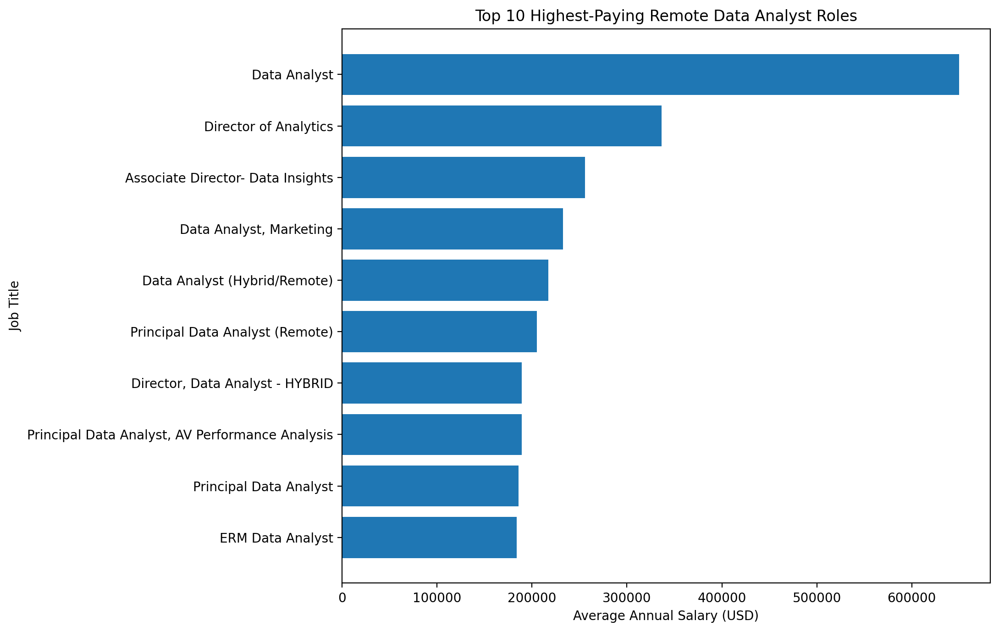

# sql_job_market_analysis
My first hands-on introduction to SQL and data cleaning came through Luke Barousse's course. This repository explores key insights from global job market data.

## Introduction

Intrigued by data and its practical applications, I dived into the world of data analytics using Luke Barousse's job market dataset. My goal was to explore the market potential for my role and map out a strategic learning path tailored to real industry needs.

I focused my investigation on **5 key questions**:

* 💰 **Top-Paying Roles:** Scoping out the highest-earning remote Data Analyst positions.
* 🔑 **Skills for the Big Bucks:** Identifying the exact skill sets tied to top-tier salaries.
* 📈 **Most Demanded Skills:** Counting overall job postings to see which skills companies want most.
* 🏷️ **Top-Paying Skills:** Pinpointing the tools that yield the highest average pay.
* 🎯 **Optimal Skills:** Uncovering the sweet spot—skills that are **both** in high demand and yield high salaries.

For **SQL Queries** check them out in the sql folder

## Background

All good things start with a question, and that exactly explains my perspective. 

I wasn't always intrigued by data, but during a class back in university, my professor gave a lecture on data, its real-world uses, and its endless potential. For some reason, that lesson stuck with me. Over the years, my curiosity kept growing until—*voilà*—I started cleaning raw datasets using Google Sheets, and today I write queries and clean data in SQL.

Enough about me, back to the data!

Driven by Luke Barousse's SQL course on the job market, the core aims of this analysis were to:

1. 💰 **Top-Paying Jobs:** Find the highest-paying roles in the Data Analyst field to scope out market potential.
2. 🔑 **Skills for Top Roles:** Discover the specific technical skills required for these high-earning positions.
3. 📈 **Most In-Demand Skills:** Identify the skills most frequently requested across all job listings.
4. 🏷️ **Top-Paying Skills:** Pinpoint which tools command the highest average salary.
5. 🎯 **Optimal Skills:** Uncover "optimal skills"—tools that are both in high demand and pay well, overcoming niche biases in pure salary data.

## Tools I Used

To clean the data and execute this analysis, I relied on:

* **SQL:** Essential for querying the dataset, saving time, and gaining a deeper understanding of the underlying data structure.
* **BigQuery Sandbox & Connected Sheets (Google Sheets):** Who says you need expensive software packages to analyze data? Technical know-how and understanding what you want to extract matter far more as an analyst—and for this project, these free cloud tools were more than sufficient.
* **GitHub:** Used to organize my SQL queries, track my project history, and showcase my findings.

## The Analysis

Every query in this section explores the overall potential of the Data Analyst job market, the high-earning skills required to reach that potential, and the baseline tools most employers are looking for today.

### 1. Top Paying Data Analyst Jobs

To identify the highest-earning opportunities, I filtered the dataset specifically for remote **Data Analyst** roles while excluding listings with missing compensation data (`WHERE salary_year_avg IS NOT NULL`). I selected the relevant job titles and salary figures, sorted the results from highest to lowest pay, and limited the output to the top 10 positions.

```sql
SELECT
  job_postings.job_id,
  job_postings.job_title,
  companies.name AS company_name,
  job_postings.job_location,
  job_postings.job_schedule_type,
  job_postings.salary_year_avg,
  job_postings.job_posted_date
FROM luke_practice.job_postings_fact AS job_postings
LEFT JOIN luke_practice.company_dim AS companies
  ON job_postings.company_id = companies.company_id
WHERE
  (job_postings.job_location = 'Anywhere' AND job_postings.job_title_short = 'Data Analyst') AND
  job_postings.salary_year_avg IS NOT NULL
ORDER BY
  job_postings.salary_year_avg DESC
  LIMIT 10
  ```

* **SQL Query File:** [`sql/01_top_paying_jobs.sql`](sql/01_top_paying_jobs.sql)

#### Top 10 Highest-Paying Remote Roles

| Job Title | Company | Annual Salary | Location |
| :--- | :--- | :---: | :---: |
| **Data Analyst** | Mantys | $650,000 | Anywhere (Remote) |
| **Director of Analytics** | Meta | $336,500 | Anywhere (Remote) |
| **Associate Director - Data Insights** | AT&T | $255,830 | Anywhere (Remote) |
| **Data Analyst, Marketing** | Pinterest | $232,423 | Anywhere (Remote) |
| **Data Analyst (Hybrid/Remote)** | UCLA Health | $217,000 | Anywhere (Remote) |
| **Principal Data Analyst** | SmartAsset | $205,000 | Anywhere (Remote) |
| **Director, Data Analyst** | Inclusively | $189,309 | Anywhere (Remote) |
| **Principal Data Analyst, AV Performance** | Motional | $189,000 | Anywhere (Remote) |
| **Principal Data Analyst** | SmartAsset | $186,000 | Anywhere (Remote) |
| **ERM Data Analyst** | Get It Recruit | $184,000 | Anywhere (Remote) |

#### Key Insights:
* **The $650k Outlier:** Mantys tops the chart with an extraordinary $650,000 salary for a "Data Analyst" title, demonstrating that certain high-equity startup roles significantly skew upper salary ranges.
* **Leadership Commands Top Dollar:** High-earning positions heavily cluster around **Director** and **Principal** level roles (ranging from $186,000 to $336,500 at major firms like Meta, AT&T, and SmartAsset).
* **100% Remote Potential:** All top 10 postings offer full-time remote options ("Anywhere"), confirming that top-tier compensation isn't restricted by physical geographic location.



*The graph below visualizes the top 10 highest-paying remote Data Analyst job postings identified through my SQL query. The visualization was generated with ChatGPT using the results returned by the query.*


These are the top-paying remote Data Analyst job postings based on our data. However, as explained earlier, this **should not** be taken as a general representation of how much a **remote Data Analyst earns**.

The analysis simply shows that some of the highest-paying postings are associated with senior and leadership-level roles, suggesting that compensation tends to increase as the level of responsibility and decision-making within a company increases.

The **Mantys** posting is a clear outlier in this dataset, with a salary of **$650,000**, far above the other postings. However, because it is an **outlier**, it should be interpreted carefully rather than used as evidence of a typical Data Analyst salary.

### 2. Top Paying Job Skills

To understand what tools top-paying roles demand, I joined the highest-earning job listings with the skills repository to see which technologies are most frequently required by top employers.

```sql
WITH top_paying_jobs AS (
SELECT
  job_postings.job_id AS job_id,
  job_postings.job_title,
  companies.name AS company_name,
  job_postings.salary_year_avg AS avg_salary,
  job_postings.job_posted_date AS posted_date
FROM luke_practice.job_postings_fact AS job_postings
LEFT JOIN luke_practice.company_dim AS companies
  ON job_postings.company_id = companies.company_id
WHERE
  (job_postings.job_location = 'Anywhere' AND job_postings.job_title_short = 'Data Analyst') AND
  job_postings.salary_year_avg IS NOT NULL
ORDER BY
  job_postings.salary_year_avg DESC
  LIMIT 10
)

SELECT
  top_paying_jobs.company_name,
  skills.skills AS skill_name,
  top_paying_jobs.avg_salary,
  top_paying_jobs.posted_date
FROM top_paying_jobs
INNER JOIN luke_practice.skills_job_dim AS skill_to_job
  ON top_paying_jobs.job_id = skill_to_job.job_id
INNER JOIN luke_practice.skills_dim AS skills
  ON skill_to_job.skill_id = skills.skill_id
ORDER BY
  top_paying_jobs.avg_salary DESC
```

* **SQL Query File:** [`sql/02_top_paying_job_skills.sql`](sql/02_top_paying_job_skills.sql)

#### Most Requested Skills in Top-Paying Roles

| Skill | Mentions in Top Roles | Key Employers Requesting |
| :--- | :---: | :--- |
| **SQL** | **8** | AT&T, Pinterest, SmartAsset, Inclusively, Motional, UCLA Health |
| **Python** | **7** | AT&T, Pinterest, SmartAsset, Inclusively, Motional, Get It Recruit |
| **Tableau** | **6** | AT&T, Pinterest, SmartAsset, Inclusively, UCLA Health |
| **R** | **4** | AT&T, Pinterest, Motional, Get It Recruit |
| **Pandas** | **3** | AT&T, SmartAsset |
| **Excel** | **3** | AT&T, SmartAsset |
| **Snowflake** | **3** | SmartAsset, Inclusively |
| **AWS** | **2** | AT&T, Inclusively |
| **Azure** | **2** | AT&T, Inclusively |
| **Power BI** | **2** | AT&T, Inclusively |

#### Key Insights:
* **The Core Stack (SQL + Python):** SQL (80% presence) and Python (70% presence) form the backbone of top-earning Data Analyst job specs.
* **Visualization Preference:** Tableau leads the high-earning bracket with 6 mentions, outperforming Power BI (2 mentions) in these specific top-tier postings.
* **Cloud & Advanced Analytics Stack:** High-paying roles frequently request cloud databases (**Snowflake**, **AWS**, **Azure**) and Python libraries (**Pandas**, **NumPy**), showing that high compensation is tied to handling modern cloud infrastructure.

### 3. Top Demanded Skills

To identify the most in-demand skills for Data Analysts across the entire job market, I aggregated skill mentions across all job postings to see which tools employers search for most frequently.

```sql
SELECT
  skills.skills AS skill_name,
  COUNT(job_postings.job_id) AS demand_count
FROM luke_practice.job_postings_fact AS job_postings
INNER JOIN luke_practice.skills_job_dim AS skill_to_job
  ON job_postings.job_id = skill_to_job.job_id
INNER JOIN luke_practice.skills_dim AS skills
  ON skill_to_job.skill_id = skills.skill_id
WHERE
  job_postings.job_location IS NOT NULL AND
  job_postings.job_title_short = 'Data Analyst'
GROUP BY
  skill_name
ORDER BY
  demand_count DESC
LIMIT 10;
```

* **SQL Query File:** [`sql/03_in_demand_skills.sql`](sql/3_in_demand_skills.sql)

#### Top 10 Most Demanded Skills

| Rank | Skill | Demand Count | Market Focus |
| :---: | :--- | :---: | :--- |
| **1** | **SQL** | **92,470** | Database Querying & Data Extraction |
| **2** | **Excel** | **66,901** | Core Spreadsheets & Quick Analysis |
| **3** | **Python** | **57,238** | Data Science, Scripting & Automation |
| **4** | **Tableau** | **46,469** | Business Intelligence & Dashboarding |
| **5** | **Power BI** | **39,419** | Enterprise Reporting & Visualizations |
| **6** | **R** | **30,038** | Statistical Analysis |
| **7** | **SAS** | **28,042** | Enterprise Analytics |
| **8** | **PowerPoint** | **13,816** | Stakeholder Presentations |
| **9** | **Word** | **13,577** | Documentation & Reporting |
| **10** | **SAP** | **11,289** | Enterprise Resource Planning |

#### Key Insights:
* **The Foundation Trio:** **SQL**, **Excel**, and **Python** represent the core foundational stack every Data Analyst needs to master.
* **SQL's Dominance:** SQL appears in over 92,000 job postings—nearly 40% more listings than second-place Excel.
* **BI Tools High Demand:** Both **Tableau** and **Power BI** command massive market presence, proving that data storytelling and visualization are mandatory requirements across organizations.

### 4. Top Paying Skills

To find the highest-paying technical skills for Data Analysts, I calculated the average annual salary associated with each skill across postings with reported salary data.

```sql
SELECT
  skills.skills As skill_name,
  ROUND(AVG(job_postings.salary_year_avg), 2) AS avg_salary
FROM
  luke_practice.job_postings_fact AS job_postings
INNER JOIN `luke_practice.skills_job_dim` AS skill_to_job
  ON job_postings.job_id = skill_to_job.job_id
INNER JOIN `luke_practice.skills_dim` AS skills
  ON skill_to_job.skill_id = skills.skill_id
WHERE
  job_postings.job_title_short = 'Data Analyst' AND
  salary_year_avg IS NOT NULL
GROUP BY
  skills.skills
ORDER BY
  avg_salary DESC
LIMIT 20;
```
* **SQL Query File:** [`sql/04_top_skills_based_on_salary.sql`](sql/04_top_skills_based_on_salary.sql)

#### Top 10 Highest-Paying Skills

| Rank | Skill | Average Annual Salary | Primary Tech Focus |
| :---: | :--- | :---: | :--- |
| **1** | **SVN** | **$400,000** | Legacy Version Control *(Niche Outlier)* |
| **2** | **Solidity** | **$179,000** | Smart Contracts / Blockchain |
| **3** | **Couchbase** | **$160,515** | NoSQL Database |
| **4** | **DataRobot** | **$155,486** | AutoML & Machine Learning |
| **5** | **Golang** | **$155,000** | Backend Programming |
| **6** | **MXNet** | **$149,000** | Deep Learning Framework |
| **7** | **dplyr** | **$147,633** | R Data Manipulation |
| **8** | **VMware** | **$147,500** | Virtualization & Cloud |
| **9** | **Terraform** | **$146,734** | Infrastructure as Code |
| **10** | **Twilio** | **$138,500** | API Infrastructure |

#### Key Insights:
* **Beware of Niche Salary Skew:** Tools like **SVN** ($400,000) rank #1 due to small sample sizes where a single high-paying listing skews the average. This proves why pure salary rankings must be cross-referenced with job demand.
* **AI & Machine Learning Premium:** Machine learning frameworks (**DataRobot**, **MXNet**, **PyTorch**, **TensorFlow**) consistently yield average salaries above $120,000.
* **DevOps & Data Engineering Overlap:** High pay strongly correlates with tools bridging analytics and software engineering (**Golang**, **Terraform**, **Kafka**, **GitLab**).

### 5. Optimal Skills (High Demand & High Pay)

To identify the most "optimal" skills for Data Analysts—balancing job stability (high demand) with top earning power (high average salary)—I analyzed skills that rank highly across both metrics.

```sql
SELECT
  skills.skills AS skill_name,
  COUNT(job_postings.job_id) AS demand_count,
  ROUND(AVG(job_postings.salary_year_avg), 2) AS avg_salary
FROM 
  luke_practice.job_postings_fact AS job_postings
INNER JOIN `luke_practice.skills_job_dim` AS skill_to_job
  ON job_postings.job_id = skill_to_job.job_id
INNER JOIN `luke_practice.skills_dim`AS skills
  ON skill_to_job.skill_id = skills.skill_id
WHERE
  (job_postings.job_title_short = 'Data Analyst' AND job_postings.job_location = 'Anywhere') AND
  job_postings.salary_year_avg IS NOT NULL
GROUP BY
  skills.skills
HAVING
  demand_count > 10
ORDER BY
  demand_count DESC,
  avg_salary DESC
```
* **SQL Query File:** [`sql/05_optimal_skills_to_learn.sql`](sql/05_optimal_skills_to_learn.sql)

#### Top Optimal Skills for Data Analysts

| Rank | Skill | Demand Count | Average Annual Salary | Strategic Takeaway |
| :---: | :--- | :---: | :---: | :--- |
| **1** | **SQL** | **398** | **$97,237** | Universal Baseline Requirement |
| **2** | **Excel** | **256** | **$87,288** | Core Analytics Tool |
| **3** | **Python** | **236** | **$101,397** | High-Demand & Six-Figure Sweet Spot |
| **4** | **Tableau** | **230** | **$99,288** | Top Visualization Leader |
| **5** | **R** | **148** | **$100,499** | Advanced Statistical Analysis |
| **6** | **SAS** | **126** | **$98,902** | Enterprise Analytics Standard |
| **7** | **Power BI** | **110** | **$97,431** | Enterprise Dashboarding |
| **8** | **Looker** | **49** | **$103,795** | High-Paying Modern BI Platform |
| **9** | **Snowflake** | **37** | **$112,948** | High-Paying Cloud Data Warehouse |
| **10** | **Azure** | **34** | **$111,225** | High-Paying Cloud Infrastructure |

#### Key Insights:
* **The High-Value Sweet Spot:** **Python** ($101,397) and **Tableau** ($99,288) offer the highest return on investment, blending large job availability with top-tier compensation.
* **Cloud & Warehouse Premium:** Cloud platforms (**Snowflake**, **Azure**, **AWS**) consistently command salaries above $108,000, presenting high-upside specialization targets.
* **Skill Stacking Necessity:** While **Excel** offers high demand (256 listings), its average salary ($87,288) is the lowest among top tools, proving that pairing spreadsheets with SQL and Python is essential for maximizing market value.

## What I Learned

Throughout this project (guided by Luke Barousse's course), I didn't just write code—I completely leveled up my technical workflow and analytical thinking. Here’s what really stuck with me:

* **Broke the SQL Phobia:** I used to think SQL was intimidating and overly complex. Once I jumped into BigQuery and started building real queries, the fear completely vanished. It’s actually intuitive once you break down the logic step-by-step.
* **Advanced Query Building:** Moved far beyond basic `SELECT` statements. I regularly used **CTEs (Common Table Expressions)**, **subqueries**, and proper join techniques to solve multi-layered data questions without messy code.
* **Massive Time Savings:** Analyzing thousands of job postings showed me how fast SQL really is. Instead of spending hours trying to clean and reshape massive datasets manually, a well-structured query got me clean results in seconds.
* **Clean Syntax & Code Architecture:** Focused heavily on formatting, indentations, and syntax layout so my `.sql` files are readable, modular, and easy for any engineer or recruiter to follow.

At the end of the day, this project helped me refine my craft, level up my technical wizardry, and—most importantly—was an absolute blast to build!

## Conclusion

### 💡 Key Insights

1. **Top Paying Jobs:** Remote Data Analyst roles reach incredible compensation ceilings, but high earnings are heavily concentrated in senior leadership and Principal-level positions ($180,000–$330,000+).
2. **Skills for High Earners:** SQL (80%) and Python (70%) form the non-negotiable technical baseline for top-paying positions, with Tableau leading the pack for visual analytics.
3. **Most Demanded Skills:** Looking at the overall global market, SQL (92,000+ postings) and Excel (66,000+ postings) are the absolute top two entry requirements across all industries.
4. **Highest Paying Technical Skills:** Niche AI/ML frameworks (PyTorch, DataRobot) and cloud/DevOps tools command top-tier compensation—though extreme outliers like SVN prove why demand must always be factored in.
5. **Optimal High-Value Skills:** Python and Tableau hit the ultimate sweet spot by combining high job market demand with $100,000+ average salary potential, while cloud platforms like Snowflake offer high-upside targets.

---

### 💭 Closing Thoughts

This project was an absolute blast to build. I started out as a novice, spending time refining each technique step-by-step from the videos and working through various real-world scenarios along the way. 

With every query I wrote and every error I fixed, my confidence grew—and I genuinely fell in love with SQL. I highly recommend this hands-on approach to any beginner looking to build real projects. You’ll definitely level up your technical skills and enjoy the process!
